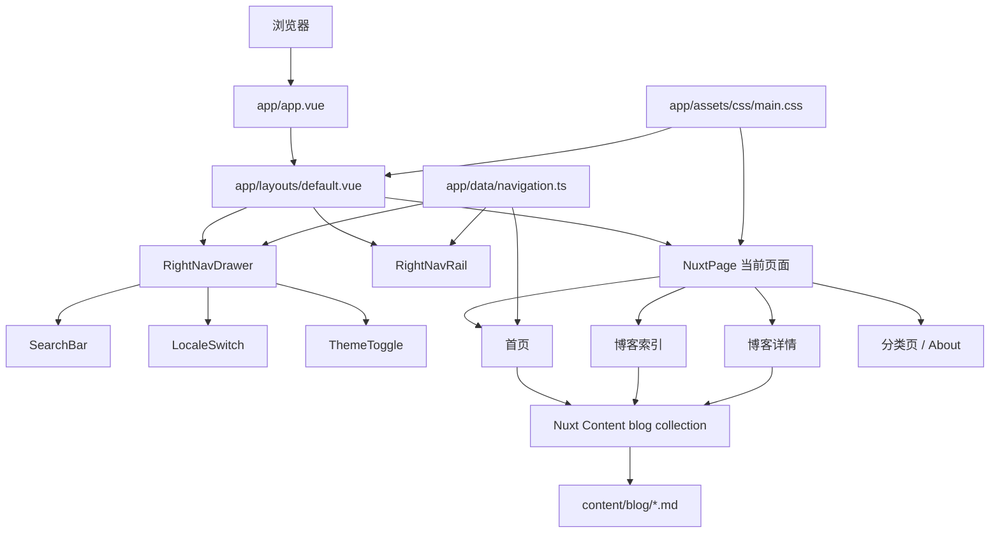
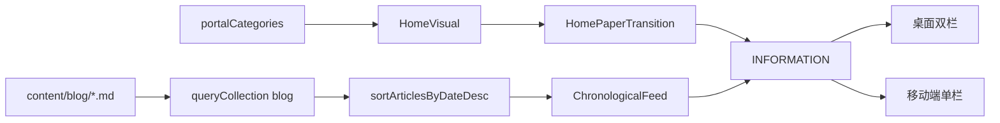

# Lonelyyang3 项目架构

本文描述当前代码的运行方式和扩展边界。视觉数值与组件外观以根目录 [`DESIGN.md`](../DESIGN.md) 为准；安装和常用命令以 [`README.md`](../README.md) 为准。

## 1. 目标与边界

Lonelyyang3 是一个内容优先的个人门户：用统一的右侧导航外壳承载首页、博客、分类推荐和个人介绍，同时保留中日双语、主题切换、搜索和响应式能力。

当前架构有意保持简单：

- 博客来自本地 Markdown，不依赖外部 CMS 或数据库服务。
- 分类推荐页目前主要是页面内静态数据，不包含后台管理系统。
- locale 体现在 URL 中；Content 文档只保存不带 locale 前缀的 canonical path。
- 所有浏览器端静态素材从 `public/` 提供，不热链参考站资源。

## 2. 系统概览



## 3. 目录职责

| 路径 | 职责 |
|---|---|
| `app/app.vue` | 根组件；设置随 locale 变化的 `html[lang]`。 |
| `app/layouts/default.vue` | 全站外壳和导航开关状态。 |
| `app/pages/` | Nuxt 文件路由页面。 |
| `app/components/layout/` | 右轨、抽屉和页脚。 |
| `app/components/sections/` | 首页主视觉、文章流、竖排分类。 |
| `app/components/content/` | 页面标题、文章行、正文和分类落地页。 |
| `app/components/ui/` | 搜索、locale、主题和回到顶部控件。 |
| `app/data/navigation.ts` | 导航顺序、路径和中日文标签的单一来源。 |
| `app/utils/` | 文章排序/分栏/日期和 locale 路径纯函数。 |
| `app/plugins/theme.client.ts` | 在抽屉控件挂载前应用保存或系统主题。 |
| `content/blog/` | canonical 博客 Markdown。 |
| `i18n/locales/` | `@nuxtjs/i18n` 实际加载的语言包。 |
| `public/` | 无需构建转换的静态资源。 |
| `tests/unit/` | 无浏览器的纯函数与数据合同。 |
| `tests/e2e/` | 路由、交互、响应式和视觉合同。 |

## 4. 应用启动与页面外壳

运行链路是：

```text
app/app.vue
  └─ NuxtLayout
      └─ app/layouts/default.vue
          ├─ NuxtPage / slot
          ├─ Footer
          ├─ RightNavDrawer
          ├─ RightNavRail
          └─ ScrollToTop
```

`default.vue` 持有唯一的 `navOpen` 响应式状态，以及共享的 `home-intro-settled` 状态。右轨触发开关，抽屉和导航链接触发关闭；监听 `route.fullPath` 可确保路由跳转后抽屉不会残留。首页进入期间，内容壳仍保留右轨 gutter，但右轨和抽屉仅在 `home-intro-settled` 后挂载；其他页面始终维持常规导航行为。

内容区通过右侧 padding 为固定导航轨保留空间：桌面、平板、手机分别对应 80px、64px、56px。抽屉覆盖内容而不让主内容重排。

## 5. 导航与抽屉

### 单一数据源

`app/data/navigation.ts` 导出：

- `portalNavItems`：十个全局导航入口。
- `portalCategories`：去掉首页和 About 后的八个首页分类。
- `getPortalNavItem()`：分类页读取标题与描述。

修改导航必须从这里开始。首页和抽屉都消费同一数组，避免顺序或路径漂移。

### 抽屉生命周期

`RightNavDrawer.vue` 使用 `Teleport` 挂载到 `body`，打开时：

1. 记录当前焦点。
2. 监听 Escape。
3. 将焦点移动到第一个导航链接。
4. 在首尾可聚焦元素之间循环 Tab。

关闭或卸载时移除 Escape 监听并恢复原焦点。抽屉底部只渲染一份搜索、语言和主题控件；固定右轨不重复这些交互。

### locale 活跃态

每个导航目标先经过 `useLocalePath()`，活跃态也使用本地化后的路径比较。这样 `/ja/blog/...` 能正确激活 Blog，而不是只识别默认语言路径。

## 6. 首页数据流

`app/pages/index.vue` 通过 `queryCollection('blog').order('date', 'DESC').all()` 读取博客，然后映射为 `ArticleListItem` 并使用 `sortArticlesByDateDesc()` 保证排序。



桌面首页将排序后索引为 `0,2,4...` 的文章放入主列，将 `1,3,5...` 放入次列；移动端重新使用完整顺序。分栏逻辑在 `app/utils/articles.ts`，而不是写死在组件模板中。

`HomeVisual.vue` 负责画面和进入阶段，状态依次为 `brand → artwork → handoff → settled`。首次绘制后 `500ms` 激活五张用户拥有的 `724×2172` 透明、预定位加载 PNG 层；`3800ms` 固定加载图从 `blur(32px)` 进入，并在 `2s` 内清晰化；`4400ms` 它开始下落，同时完整 Logo 组以模糊淡出退出；`5900ms` 进入交接并显示最终品牌；`7900ms` settled，设置 `home-intro-settled`。

固定加载图与最终主图使用同一临时 `1920×2566` 资源，但职责分离：前者只服务进入动画，后者是正常文档流中的完整主视觉。`HomePaperTransition` 位于主视觉之后，在其底缘衔接 INFORMATION。`prefers-reduced-motion: reduce` 下保留相同 DOM，跳过进入阶段并立即进入 settled。

## 7. 博客与 Content 3

### Collection

`content.config.ts` 定义 `blog` page collection。frontmatter 字段为：

- `title`
- `description`
- `date`
- `category`
- `tags`
- `cover`

### 索引

`app/pages/blog/index.vue` 查询全部文章、按日期排序，并根据 `route.query.category` 做客户端筛选。列表统一由 `ArticleRow` 渲染，因此首页、博客和搜索结果遵守相同的 locale 路径规则。

### 详情与 canonical path

详情文件是 `app/pages/blog/[...slug].vue`。对当前内容，它表现为 `/blog/:slug`；使用 catch-all 文件可让路径解析集中在同一入口。

日语 URL 与 Content path 的关系：

```text
/ja/blog/linux-commands
  └─ canonicalContentPathFromRoute()
      └─ /blog/linux-commands
          └─ queryCollection('blog').path(...).first()
```

Content 文档不保存 `/ja` 前缀。页面查询前剥离 locale，渲染上一篇、下一篇和返回链接时再通过 `useLocalePath()` 加回当前 locale。

找不到内容时页面显式抛出 Nuxt 404。正文交给 `ArticleProse -> ContentRenderer`，标题、元信息、标签和封面由详情页头部渲染。

## 8. 分类页

以下页面复用 `CategoryLanding`：

- Projects
- Movies
- Anime
- Music
- Tools
- Life
- Notes

每个页面仅负责提供 `nav-key`、条目数组和布局类型。`CategoryLanding` 从导航数据读取本地化标题，再把条目转换为 `ArticleRow` 能消费的结构。

`app/pages/about.vue` 是定制页面，因为它需要人物视觉、竖排自我介绍、技能列表、经历时间线和社交链接；它仍复用 `PaperSectionHeading` 和 `PatternDecoration`。

## 9. 国际化

`nuxt.config.ts` 设置：

- 默认 locale：`zh`
- 策略：`prefix_except_default`
- 中文：无前缀
- 日语：`/ja` 前缀

运行时语言包位于 `i18n/locales/`。`app/app.vue` 根据 locale 设置 `zh-CN` 或 `ja` 的 HTML language 属性。

站内链接使用 `useLocalePath()`，语言切换使用 `useSwitchLocalePath()`；不要手工拼接 `/ja`，博客 canonical 查询函数除外。

## 10. 主题

主题分成初始化和交互两部分：

1. `app/plugins/theme.client.ts` 在客户端启动时读取 `localStorage.theme`；没有保存值时读取系统深色偏好，并切换 `html.dark`。
2. `ThemeToggle.vue` 挂载时读取根元素状态，点击后更新 class 和 localStorage。
3. `app/assets/css/main.css` 在 `:root` 与 `:root.dark` 下提供同名语义令牌。

主题控件只在抽屉展开后存在，但主题初始化不依赖抽屉挂载。

## 11. 样式与设计令牌

项目主要使用两层样式：

- `main.css`：全局语义令牌、纸张素材 URL、rail/drawer 尺寸、浅深主题和 reduced-motion 兜底。
- 组件旁 scoped CSS：具体布局、排版和交互状态。

Tailwind 可用于基础工具类，但当前视觉系统以 CSS variables 和 scoped CSS 为主。新增共享颜色、材质或尺寸时，先更新 `DESIGN.md` 和 `main.css`，再由组件消费。

视觉约束包括：开放式排版而非卡片墙、SVG 结构图标、只用 transform/opacity 表达主要动效，以及 CJK 语义短语不出现异常孤行。

## 12. 素材

浏览器静态路径均从 `/` 开始，避免 `/ja/images/...` 这类 locale 误解析。

用户拥有的运行时品牌素材位于 `public/images/brand/`，其来源记录以根目录 `ASSET-SOURCES.md` 为准。`public/images/reference/deaimon/` 是开发预览临时素材目录，目录内 `ASSET-SOURCES.md` 记录来源与替换状态；这些文件可用于本地开发和布局验证，但不能作为生产素材就绪的依据。`hero-main.png` 以完整比例作为正常流主图使用，不是按焦点裁切的页面背景。

正式发布前应：

1. 使用自有或获得许可的图片替换该目录内容。
2. 保留组件使用的宽高比；`hero-main.png` 继续以完整比例的正常流图片接入。
3. 浏览全部路由，确认网络请求不再命中 `/images/reference/deaimon/`。
4. 更新素材清单和 README 状态。

## 13. 路由矩阵

| 页面 | 默认 | 日语 |
|---|---|---|
| Home | `/` | `/ja` |
| Blog | `/blog` | `/ja/blog` |
| Blog detail | `/blog/:slug` | `/ja/blog/:slug` |
| Projects | `/projects` | `/ja/projects` |
| Movies | `/movies` | `/ja/movies` |
| Anime | `/anime` | `/ja/anime` |
| Music | `/music` | `/ja/music` |
| Tools | `/tools` | `/ja/tools` |
| Life | `/life` | `/ja/life` |
| Notes | `/notes` | `/ja/notes` |
| About | `/about` | `/ja/about` |

## 14. 测试架构

### 单元测试

- `navigation.test.ts`：导航顺序、分类数量和无 Emoji 合同。
- `articles.test.ts`：日期排序、不可变性、奇偶分栏和日期格式。
- `paths.test.ts`：`/ja` canonical path、slug 和 locale 路径。

### 浏览器测试

- `redesign.spec.ts`：右轨、抽屉、焦点、搜索/主题和首页结构。
- `blog-routes.spec.ts`：索引顺序、筛选、详情、locale 和 404。
- `category-pages.spec.ts`：共享分类页与 About。
- `final-qa.spec.ts`：路由矩阵、素材请求、断点、主题、减弱动效和截图。
- `oracle-regressions.spec.ts`：主题启动、搜索激活、locale 活跃态、回顶和标签。

测试优先断言可观察行为和稳定 `data-testid`，避免依赖内部响应式状态。

## 15. 扩展方法

### 新增文章

1. 在 `content/blog/` 添加 Markdown。
2. 使用 `content.config.ts` 允许的 frontmatter。
3. 将封面放在 `public/images/posts/` 或其他自有素材目录。
4. 运行博客 E2E、单测和构建。

### 新增分类

1. 扩展 `PortalRouteKey`。
2. 在 `portalNavItemsByKey` 添加完整中日文数据、路径、test ID 和首页显示状态。
3. 将记录加入有序的 `portalNavItems`，并决定是否加入 `portalCategories`。
4. 新建页面并优先复用 `CategoryLanding`。
5. 更新 route matrix 测试和语言资源。

### 新增 locale

1. 在 `nuxt.config.ts` 注册 locale 和 JSON 文件。
2. 扩展导航数据的本地化字段或改造为翻译 key。
3. 更新 `app.vue` 的 lang 映射。
4. 验证首页、抽屉、搜索和文章 canonical 路径。

### 新增设计原语

跨两个以上页面使用的视觉模式应进入 `app/components/content/`、`sections/` 或 `decor/`，并在 `DESIGN.md` 记录合同。一次性页面样式保留在页面旁。

## 16. 已知技术债务

以下项目已经确认，但本次文档同步不做破坏性删除：

| 债务 | 证据/影响 | 建议 |
|---|---|---|
| 旧布局与卡片组件仍在仓库 | `Header.vue`、`Sidebar.vue`、`HeroSection.vue`、`AboutSection.vue`、`CategoryGrid.vue`、`LatestPosts.vue`、`ContentCard.vue`、`TagBadge.vue` | 确认无引用后集中删除，并跑完整测试/构建。 |
| locale 文件重复 | `app/locales/` 未被当前 i18n 配置引用；活跃目录是 `i18n/locales/` | 对比内容后删除旧副本。 |
| 搜索每次输入读取完整集合 | `SearchBar.vue` | 缓存集合、debounce，或构建轻量索引。 |
| 主题状态分散 | `theme.client.ts` 与 `ThemeToggle.vue` 都直接操作 DOM/localStorage | 提取 `useTheme()` composable。 |
| RSS 链接没有实现 | `Footer.vue` 指向 `/atom.xml`，未找到生成逻辑 | 实现 Content feed 或暂时移除链接。 |
| 图片管线未统一 | 已启用 `@nuxt/image`，多数页面仍使用原生 `` | 切换为响应式 Nuxt Image，并生成自有 WebP/AVIF。 |
| 推荐分类仍是静态条目 | 多个 `app/pages/*/index.vue` | 新增 Content collections，使内容可持续维护。 |
| 临时素材不可生产发布 | `public/images/reference/deaimon/` | 替换素材后执行零请求审计。 |

## 17. 文档权威层级

遇到冲突时按以下顺序判断：

1. 当前代码和测试。
2. `README.md`、`DESIGN.md`、`docs/ARCHITECTURE.md`。
3. `.superpowers/sdd/final-report.md`（验证快照）。
4. `docs/superpowers/**` 和 `.superpowers/sdd/task-*`（历史执行档案，不是现役要求）。

历史计划中的工作流、旧测试数量、旧焦点值或旧文件名不应覆盖当前代码与现役文档。
